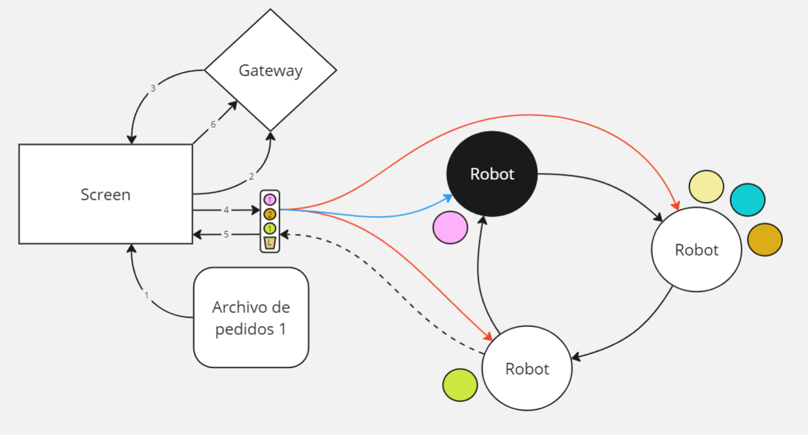
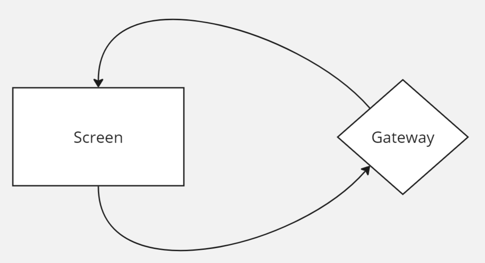
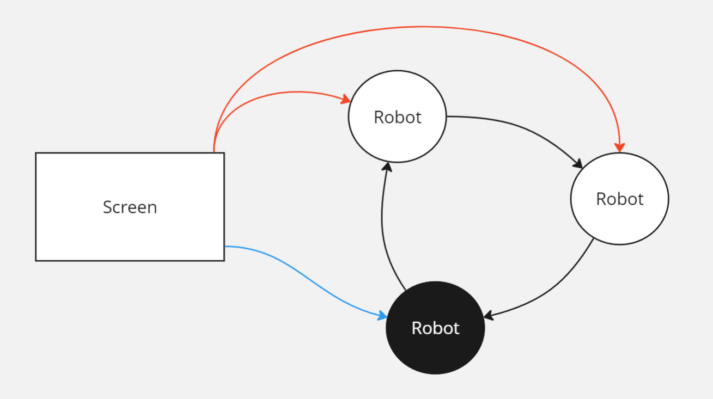
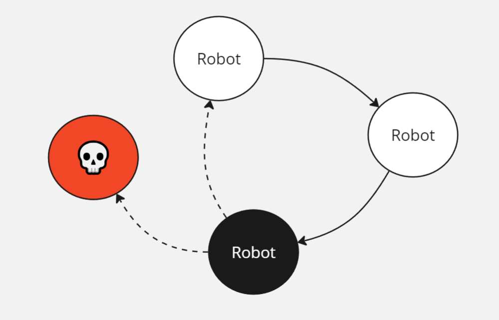
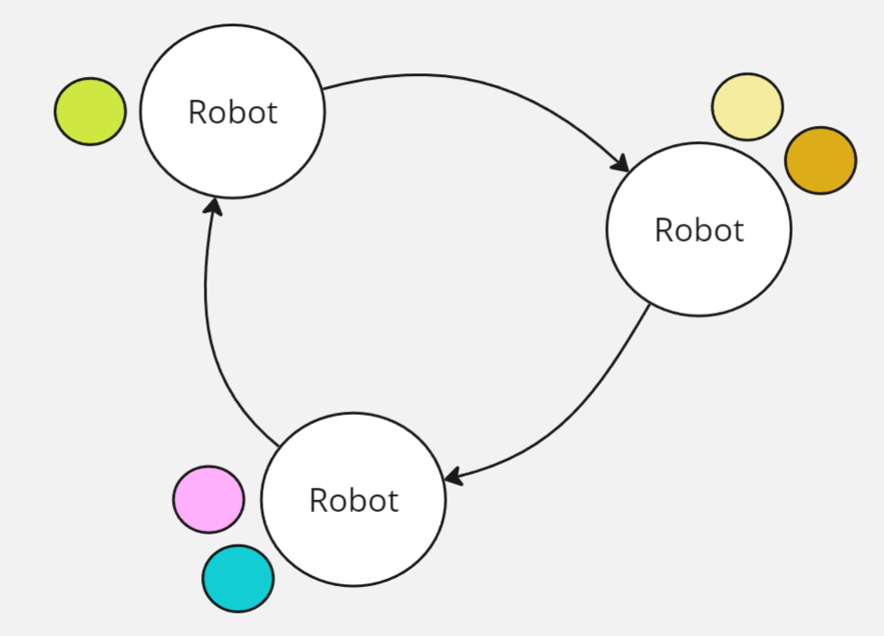
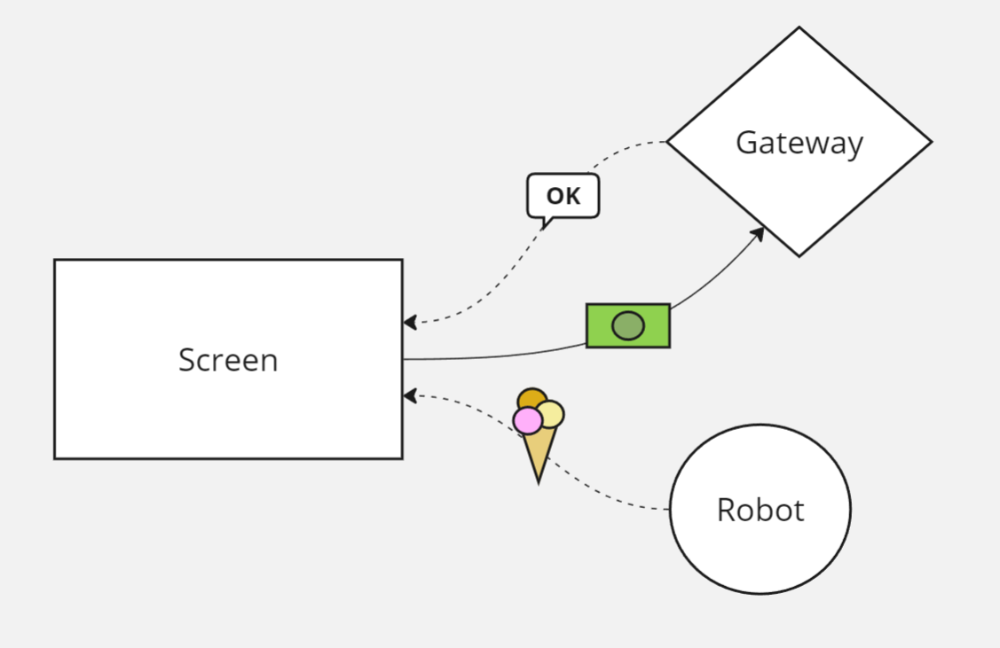

# TP2 - Heladeria

Una importante cadena de heladerías desea abrir una sucursal completamente robotizada. Los clientes harán su pedido sobre una interfáz gráfica eligiendo gustos y tamaño. Luego un conjunto de robots podrán resolver los pedidos de forma concurrente, tal como lo hacen los heladeros los días de calor. Así mismo, cada contenedor con un gusto de helado podrá ser utilizado solamente por un robot a la vez. Finalmente se le entregará su helado al cliente; y solamente se le cobrará en la tarjeta si efectivamente se pudo completar su pedido.

## Integrantes

| Nombre                                               | Padrón |
| ---------------------------------------------------- | ------ |
| [Bianchi, Marcos](https://github.com/MarcosBianchii) | 108921 |
| [Berenguel, Rafael](https://github.com/RafaB15)      | 108225 |
| [Ghosn, Lautaro Gabriel](https://github.com/LGhosn)  | 106998 |

## Ejecución

### Tests

## Diseño e implementación

### Pantallas

Cada pantalla es un proceso independiente que recibe como argumentos:

1. Un identificador.
2. Un path a un archivo de simulación de pedidos.

El número de identificación se usa como offset dentro de un rango pre-establecido de puertos ip para sincronizar a las pantallas con la finalización de helados de robots.

En el archivo que se le pasará a  la pantalla, están definidos en formato *jsonl* los diferentes pedidos de los clientes que serán simulados por esa pantalla.

A medida que la pantalla va leyendo los pedidos, los va a ir procesando y mandando a los robots para que se encarguen de preparalos.

La secuencia de pedido es tal que así:

1. Se lee el pedido del archivo de pedidos, se procesa y se arma la orden de pedido
1. Se envía al gateway la tarjeta del cliente para capturar el pago
1. El gateway responde, de ser válido se sigue, sino se ignora el pedido
1. Se envía el pedido a todos los robots
1. El robot que armó el helado envía una confirmación a la pantalla que se hizo el helado
1. Se termina de confirmar al gateway que el pedido se realizó con exito para terminar la transacción

#### Resiliencia a caidas de pantallas

Los robots al terminar de procesar un pedido intentan notificar a la pantalla creadora del pedido, en caso de no responder se lo envían a otra y esto se repite por todo el rango de puertos de pantallas hasta que alguna conteste. Si ninguna contesta entonces
no hay mucho para hacer, el pedido se descarta y se sigue con otro.

Una vez se intercepta el pedido finalizado, esta pantalla notifica al gateway para cerrar la transacción y de esta forma efectua el pago por el helado.

#### Comienzo de la transacción

Por cada pedido que vaya llegando a la pantalla se enviarán los detalles del pago al broker el cual responderá si se puede autorizar o no (hace la captura del pago).

#### El caso que se rechaza la tarjeta

La tarjeta será rechazada cuando la suma de todos sus digitos sea multiplo de 3.

### Robots

Estas entidades son las que decidimos modelar usando el modelo de actores que pide la consigna.

Los robots también seguiran la misma idea donde viviran dentro de un rango pre-establecido de puertos en donde todos reciben pedidos de todas las pantallas.

El `id = 0` es especial, será quién comience con el token de pedidos.

#### Método de resolución de pedidos

Se utilizará el algoritmo de Token Ring para determinar quién agrega un pedido a la lista de pedidos. Este token contiene información sobre los ids de los robots en la red y una lista de pedidos ordenados por orden de llegada.

Quién tenga el token será quién agregue el pedido a esta lista. Antes de agregar un pedido se verifica que no esté ya dentro, pues se podría dar el caso de que a un robot le llegue tarde el mensaje e intente encolar algo que fué ya encolado.

Cuando un robot se encuentra disponible, espera a recibir el token. Una vez lo consigue desencola el pedido más viejo y se pone a trabajar.

#### Resiliencia a caidas de robots

Cada vez que se pasa el token se espera por un ack y por otro mensaje particular que representa la finalización del uso del token por parte del siguiente robot.

Orden de operaciones:
1. Recibe el token.
1. Responde el ack.
1. ...
1. Envia el token al siguiente.
1. Envia el mensaje de fin de uso del token al anterior.
1. Espera por el ack del siguiente.

De esta forma si el robot que tiene el token cae, el anterior se entera porque no contestó el mensaje de fin de uso.

#### Sección Crítica

Se usa el algoritmo de Token Ring con una modificación de varios tokens.

Cada token representa un sabor dentro de la red y guarda la cantidad de helado restante para ese gusto.

Los robots se pasan los tokens de sabores y van a ir quitando la cantidad que necesiten de cada uno a medida que lleguen los tokens.

#### Resiliencia a caidas de robots

Es la misma estrategia de resolución que la del token de pedidos, un ack y un mensaje de fin de uso.

### Finalización del pedido

Una vez terminado el helado, se le confirma a la pantalla que lo pidió su finalización y esta le confirma el pago al gateway de pagos en caso que se haya podido concretar el helado, en caso contrario se le devolverá el dinero al cliente.

